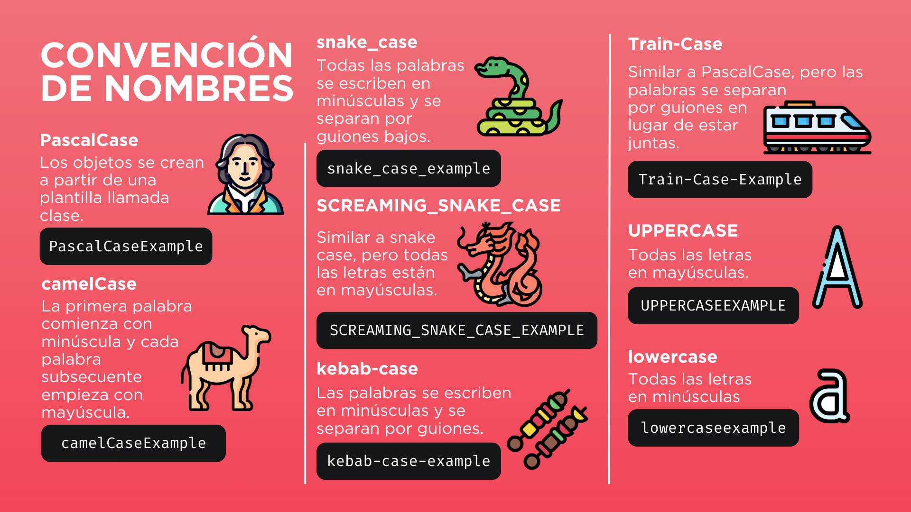

# Proyecto: **TO-DO List** 🗂️


# **To-Do List App - Gestión Inteligente de Tareas**

Este proyecto consiste en el desarrollo de una aplicación web orientada a la gestión eficiente de tareas tanto personales como colaborativas. Está construida utilizando el framework **Flask** en el backend (Python) y **MySQL** como sistema de gestión de bases de datos. Su propósito principal es facilitar la organización del trabajo diario mediante una interfaz intuitiva y funcionalidades modernas que promueven la productividad y la colaboración entre usuarios.

La aplicación está diseñada para ser utilizada por individuos, equipos pequeños y medianos, instituciones educativas, o cualquier entorno que requiera seguimiento estructurado de actividades. Entre sus principales características se destacan:

- Autenticación segura de usuarios.
- Interfaz tipo Kanban con tareas clasificadas según su estado.
- Gestión de permisos para tareas compartidas.
- Filtros avanzados y categorización de tareas.

---

## **Características Principales**


### **Seguridad**

- Implementación de autenticación mediante hashing seguro con PBKDF2 y salt.
- Protección contra vulnerabilidades comunes como CSRF (Cross-Site Request Forgery), XSS (Cross-Site Scripting) e inyecciones SQL.
- Uso de cookies con atributos `HttpOnly` y `Secure` para mayor protección en entornos productivos.

### **Gestión de Tareas**

- Funcionalidad CRUD (Crear, Leer, Actualizar y Eliminar) para tareas.
- Asignación de fechas de vencimiento con indicadores visuales de alerta.
- Interfaz tipo "drag and drop" para mover tareas entre estados: "Nueva", "En progreso" y "Completada".
- Posibilidad de asignar categorías a las tareas y filtrarlas según criterios personalizados.

### **Colaboración**

- Compartición de tareas mediante invitación por correo electrónico.
- Definición de permisos a nivel de tarea (solo lectura o lectura y escritura).
- Registro de historial de cambios en tareas compartidas para seguimiento de modificaciones.

### **Interfaz de Usuario**

- Diseño adaptable a diferentes resoluciones (responsive), compatible con dispositivos móviles y de escritorio.
- Uso de ventanas modales para realizar acciones rápidas sin necesidad de recargar la página.
- Notificaciones en tiempo real mediante tecnologías como WebSockets (en futuras versiones).

---

## **Requisitos del Sistema**

| Componente | Versión Recomendada | Instalación |
| --- | --- | --- |
| Python | 3.10 o superior | [https://www.python.org/downloads/](https://www.python.org/downloads/) |
| MySQL | 8.0 o superior | [https://dev.mysql.com/downloads/](https://dev.mysql.com/downloads/) |
| Git | 2.30 o superior | [https://git-scm.com/downloads](https://git-scm.com/downloads) |

---

## **Instalación y Configuración**

### 1. Clonar el Repositorio

```bash
git clone https://gitlab.com/AndreaGutierrez_Jala_U/project_to_do_list.git
cd project_to_do_list

```

### 2. Crear y Activar un Entorno Virtual

```bash
python -m venv venv
# En Windows:
venv\Scripts\activate
# En Linux/macOS:
source venv/bin/activate

```

### 3. Instalar las Dependencias del Proyecto

```bash
pip install -r requirements.txt

```

### 4. Configurar la Base de Datos

1. Crear una base de datos en MySQL llamada `todo_list`.
2. Ejecutar el script de creación de tablas y datos iniciales:

```bash
mysql -u [usuario] -p todo_list < database/To_do_list_database_schema.sql

```

1. Configurar las variables de entorno (crear archivo `.env` a partir de `.env.example`):

```
MYSQL_HOST=localhost
MYSQL_USER=tu_usuario
MYSQL_PASSWORD=tu_contraseña
MYSQL_DB=todo_list
SECRET_KEY=clave_secreta_generada

```

---

## **Ejecución del Proyecto**

Iniciar el servidor Flask con el siguiente comando:

```bash
flask run

```

Una vez iniciado, la aplicación estará disponible localmente en: `http://localhost:5000`

---

## **Pruebas con Datos Iniciales (Opcional)**

Para pruebas rápidas, se puede insertar un usuario manualmente:

```sql
INSERT INTO Usuario (email, password_hash, nombre_completo)
VALUES ('test@example.com', 'hash_generado', 'Usuario Demo');

```

---

## **Guía de Uso**

1. **Registro e Inicio de Sesión**
    - Visitar `/register` para crear una cuenta.
    - Ingresar a `/login` para autenticarse.
2. **Gestión de Tareas**
    - Crear tareas asignando título, descripción y fecha de vencimiento.
    - Utilizar la vista Kanban para cambiar el estado de las tareas.
    - Editar y eliminar tareas según sea necesario.
3. **Compartición y Colaboración**
    - Compartir tareas mediante correo electrónico.
    - Seleccionar permisos para los colaboradores (lectura o edición).
    - Ver historial de cambios en tareas compartidas.
4. **Filtrado y Categorización**
    - Aplicar filtros por categorías desde el panel lateral.
    - Gestionar categorías según preferencias del usuario.

---

## **Comandos Útiles**

| Acción | Comando |
| --- | --- |
| Reiniciar base de datos | `flask init-db` (script propio) |
| Ejecutar pruebas | `pytest tests/` |

---

## **Documentación Adicional**

- **Diagramas de Arquitectura**: disponibles en la carpeta `docs/diagrams/`.
- **Guía de Seguridad**: archivo `docs/SECURITY.md`.
- **Documentación de la API**: archivo `docs/API.md`.

---

## **Contribuciones**



Las contribuciones están abiertas a toda persona interesada. Para participar:

1. Realizar un fork del repositorio.
2. Crear una nueva rama (`feature/nombre-del-cambio`).
3. Subir los cambios y enviar un Pull Request con la descripción correspondiente.

---

## **Información de Contacto**

- Repositorio del Proyecto:
    
    [https://gitlab.com/AndreaGutierrez_Jala_U/project_to_do_list.git](https://gitlab.com/AndreaGutierrez_Jala_U/project_to_do_list.git)