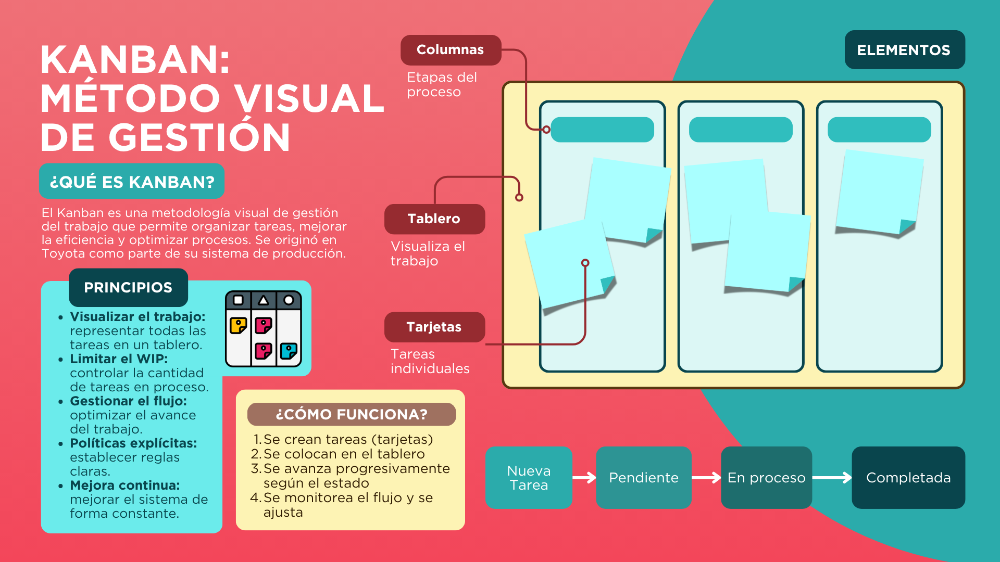
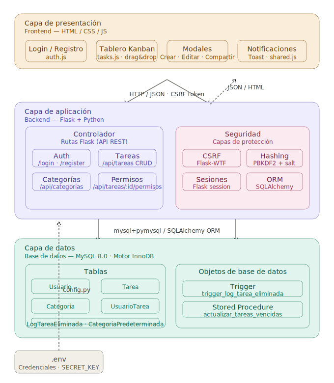
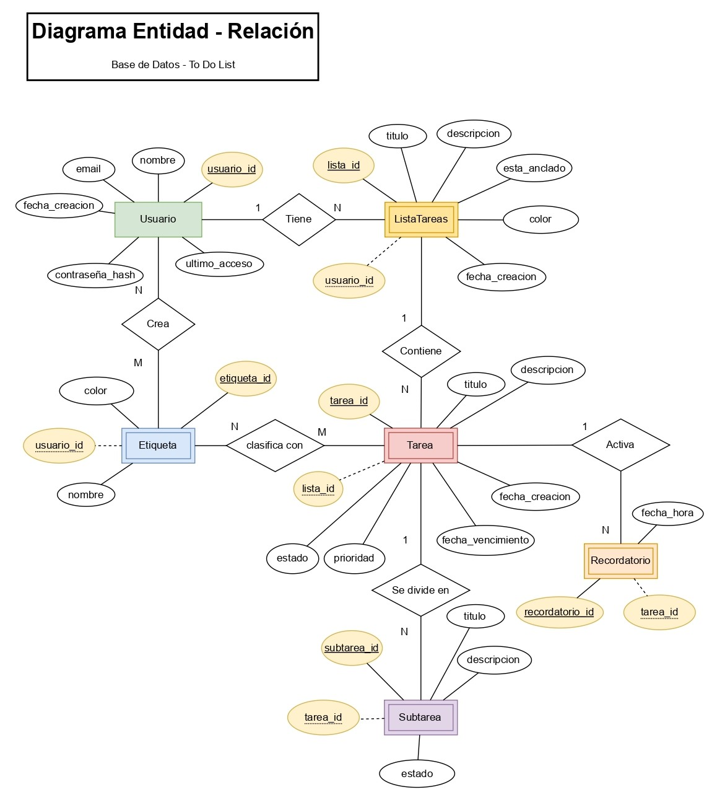
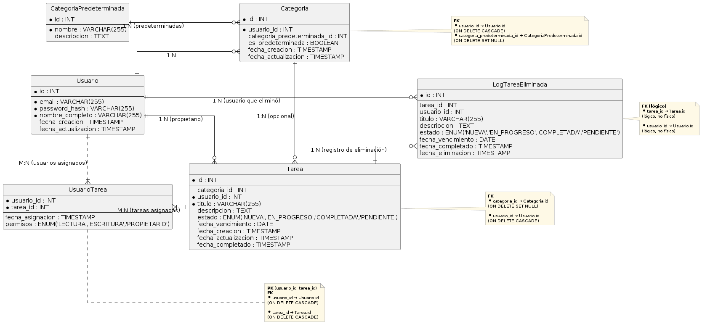
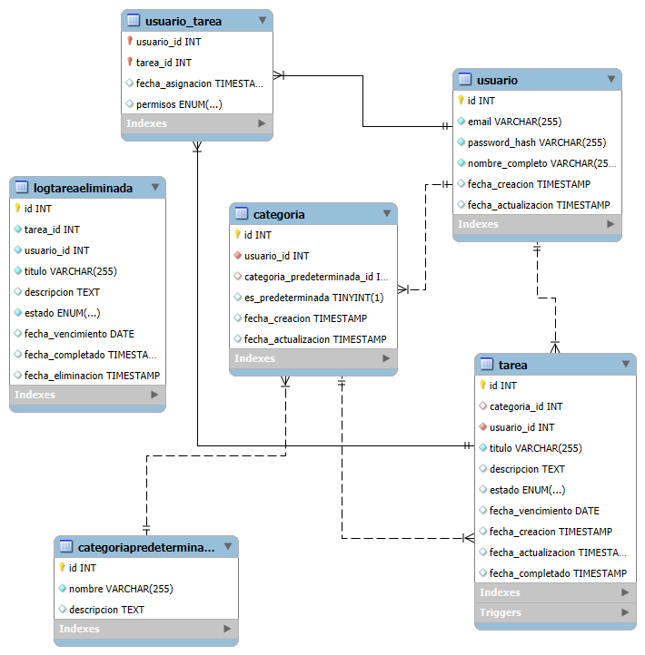

# To Do List

[](#)
[](#)
[](#)
[](#)
[](#)
[](#)


# To-Do List - Gestión de Tareas 🗂️

## Descripción del Proyecto

Este proyecto consiste en el desarrollo de una aplicación web orientada a la gestión eficiente de tareas tanto personales como colaborativas. Está construida utilizando el framework **Flask** en el backend (Python) y **MySQL** como sistema de gestión de bases de datos. Su propósito principal es facilitar la organización del trabajo diario mediante una interfaz intuitiva y funcionalidades modernas que promueven la productividad y la colaboración entre usuarios.

La aplicación está diseñada para ser utilizada por individuos, equipos pequeños y medianos, instituciones educativas, o cualquier entorno que requiera seguimiento estructurado de actividades. Entre sus principales características se destacan:

- Autenticación segura de usuarios.
- Interfaz tipo Kanban con tareas clasificadas según su estado.
- Gestión de permisos para tareas compartidas.
- Filtros avanzados y categorización de tareas.

---

## Características

- **Seguridad**
    - Autenticación mediante hashing seguro con PBKDF2 y salt.
    - Protección contra vulnerabilidades comunes: CSRF, XSS e inyecciones SQL.
    - Uso de cookies con atributos `HttpOnly` y `Secure`.
- **Gestión de Tareas**
    - CRUD completo de tareas.
    - Asignación de fechas de vencimiento con indicadores visuales de alerta.
    - Interfaz tipo Kanban con arrastrar y soltar para mover tareas entre estados: *Nueva*, *En progreso*, *Pendiente* y *Completada*.
    - Categorización de tareas y filtrado por categorías.
- **Colaboración**
    - Compartición de tareas mediante invitación por correo electrónico.
    - Definición de permisos a nivel de tarea (lectura o escritura).
    - Historial de cambios en tareas compartidas mediante logs automáticos.
- **Interfaz de Usuario**
    - Diseño adaptable (responsive) para móviles y escritorio.
    - Ventanas modales para acciones rápidas sin recargar la página.
    - Notificaciones en tiempo real.

---

## Requisitos del Sistema

Antes de instalar y ejecutar el proyecto, asegúrate de contar con los siguientes elementos:

- **Python 3.10** o superio
- **MySQL 8.0** o superior
- **Git** (opcional, para clonar el repositorio)
- Gestor de paquetes `pip` (incluido con Python)

---

## **Instalación y Configuración**

1. Clonar el Repositorio

```bash
   git clone https://github.com/GutBla/PROJECT_To_Do_List.git
   cd PROJECT_To_Do_List
```

2. Crear y Activar un Entorno Virtual

```bash
python -m venv venv
# En Windows:
venv\Scripts\activate
# En Linux/macOS:
source venv/bin/activate
```

3. Instalar las Dependencias del Proyecto

```bash
pip install -r requirements.txt
```

4. Configurar la Base de Datos

- Crear una base de datos en MySQL llamada `todo_list`.
- Ejecutar el script de creación de tablas y datos iniciales:
    
    ```bash
    mysql -u [usuario] -p todo_list < backend/database/To_do_list_database_schema.sql
    
    ```
    
- Configura las variables de entorno creando un archivo `.env` en la raíz del proyecto (o usar como plantilla el  `.env.example`):
    
    ```
    MYSQL_HOST=localhost
    MYSQL_USER=tu_usuario
    MYSQL_PASSWORD=tu_contraseña
    MYSQL_DB=todo_list
    
    ```
    

5. Ejecutar el proyecto

Para iniciar la aplicación, asegúrate de tener activado el entorno virtual y ejecuta:

```
# Desde la raíz del proyecto
python backend/app.py
```

Alternativamente, puedes usar el comando `flask`:

```
# Configurar la variable de entorno (ejemplo para Windows)
set FLASK_APP=backend.app
flask run
```

Una vez iniciado, la aplicación estará disponible localmente en: `http://localhost:5000` o `http://127.0.0.1:5000`

---

## **Uso**

Una vez instalado y configurado, la aplicación se puede utilizar siguiendo estos pasos:

1. **Registro e inicio de sesión**
    - Accede a `/register` para crear una nueva cuenta.
    - Inicia sesión en `/login` con tus credenciales.
2. **Gestión de tareas**
    - Crea nuevas tareas desde el botón *Nueva Tarea*.
    - Visualiza las tareas en el tablero Kanban.
    - Arrastra las tarjetas para cambiar el estado de una tarea.
    - Edita o elimina tareas según tus permisos.
3. **Compartir tareas**
    - En la tarjeta de una tarea propia, haz clic en el icono de compartir.
    - Ingresa el correo electrónico de otro usuario registrado.
    - Selecciona los permisos (lectura o escritura).
    - Gestiona los colaboradores desde el mismo modal.
4. **Filtrado y categorías**
    - En el panel lateral, selecciona una categoría para filtrar las tareas.
    - Crea nuevas categorías, edítalas o elimínalas desde la barra lateral.

---

## ¿Qué es una To-Do List?

Una To-Do List es una herramienta de gestión personal y organizacional que permite a los usuarios registrar, priorizar y dar seguimiento a tareas pendientes. En el contexto de este proyecto, la aplicación no solo permite listar actividades, sino que incorpora funcionalidades colaborativas, categorización y control de estado mediante un tablero Kanban interactivo, facilitando una organización visual y estructurada del trabajo diario.

La aplicación está diseñada para ayudar a individuos y equipos a mejorar su productividad mediante la claridad en las tareas asignadas, la visibilidad de plazos de entrega y la posibilidad de delegar actividades con niveles de permiso diferenciados.


---

## Requisitos del Sistema

### Requisitos Funcionales

| ID | Nombre | Descripción |
| --- | --- | --- |
| RF-01 | Autenticación | Registro e inicio de sesión con validación de credenciales, contraseñas hasheadas y manejo de sesiones seguras. |
| RF-02 | Gestión de Tareas (CRUD) | Crear, leer, actualizar y eliminar tareas con campos de título, descripción, fecha de vencimiento y estado (`Nueva`, `Pendiente`, `En Progreso`, `Completada`). |
| RF-03 | Categorización | Creación, edición y eliminación de categorías personalizadas para organizar las tareas, con filtros por categoría. |
| RF-04 | Tablero Kanban | Visualización de tareas organizadas por estado, con funcionalidad drag-and-drop para cambiar estados. |
| RF-05 | Compartición y Permisos | Compartir tareas con otros usuarios mediante correo electrónico, asignando permisos de lectura o escritura. |
| RF-06 | Historial de Eliminación | Registro automático de tareas eliminadas mediante trigger en base de datos para trazabilidad. |

### Requisitos No Funcionales

| ID | Nombre | Descripción |
| --- | --- | --- |
| RNF-01 | Seguridad | Protección CSRF, XSS, inyección SQL, cookies `HttpOnly`/`Secure` y hashing de contraseñas con PBKDF2. |
| RNF-02 | Escalabilidad | Arquitectura modular con separación clara entre frontend, backend y base de datos, permitiendo futuras migraciones a microservicios. |
| RNF-03 | Usabilidad | Interfaz responsiva adaptada a dispositivos móviles y escritorio, con modales intuitivos y notificaciones visuales. |
| RNF-04 | Rendimiento | Consultas optimizadas mediante índices en campos frecuentes (`email`, `estado`, `fecha_vencimiento`) y uso de ORM para minimizar latencia. |

---

## Arquitectura



### Patrón Arquitectónico (Cliente-Servidor / MVC)

La aplicación sigue una arquitectura **cliente-servidor** con el patrón **Modelo-Vista-Controlador (MVC)**:

- **Modelo:** Gestionado por SQLAlchemy. Define las entidades (`Usuario`, `Tarea`, `Categoría`, etc.) y sus relaciones.
- **Vista:** Implementada con plantillas Jinja2 en el backend y HTML/CSS/JS en el frontend.
- **Controlador:** Flask maneja las rutas y la lógica de negocio, exponiendo una API RESTful consumida por el frontend.

### Componentes del Sistema

| Componente | Tecnología | Responsabilidad |
| --- | --- | --- |
| Backend | Flask + Python | Procesa solicitudes HTTP, valida datos, gestiona sesiones y aplica reglas de negocio. |
| Base de Datos | MySQL | Almacenamiento persistente con triggers, procedimientos almacenados y restricciones de integridad. |
| Frontend | HTML / CSS / JS | Interfaz de usuario: tablero Kanban, modales, drag-and-drop y consumo de la API REST. |
| ORM | SQLAlchemy | Capa de abstracción que traduce operaciones Python a consultas SQL. |

> El diagrama de arquitectura se encuentra en el archivo `arquitectura.mmd` adjunto a esta documentación.
> 

---

## Base de Datos

### Normalización

La base de datos fue diseñada siguiendo las reglas de normalización hasta la **Tercera Forma Normal (3FN)**, eliminando redundancias y garantizando dependencias funcionales claras:

- **1FN — Primera Forma Normal:** Cada tabla posee una clave primaria única y atributos atómicos. La tabla `Tarea` utiliza `id` como PK y cada campo almacena un único valor.
- **2FN — Segunda Forma Normal:** Se eliminaron dependencias parciales. La tabla `UsuarioTarea` separa la compartición de tareas del resto de atributos de la entidad `Tarea`.
- **3FN — Tercera Forma Normal:** Se eliminaron dependencias transitivas. La categoría se normaliza en tablas independientes (`Categoria` y `CategoriaPredeterminada`), evitando redundancia en la tabla `Tarea`.

### Estructura de Tablas

| Tabla | Descripción |
| --- | --- |
| `Usuario` | Almacena datos de autenticación. Índice único en `email`. |
| `CategoriaPredeterminada` | Catálogo de categorías base reutilizables por todos los usuarios. |
| `Categoria` | Relaciona usuarios con categorías predeterminadas o personalizadas. |
| `Tarea` | Entidad principal. Índices en `usuario_id`, `estado` y `fecha_vencimiento`. |
| `UsuarioTarea` | Tabla intermedia para compartición de tareas con permisos diferenciados. |
| `LogTareaEliminada` | Tabla histórica para auditoría de eliminaciones. |

### Diseño Físico

**Motor de almacenamiento:** InnoDB para todas las tablas (soporte transaccional e integridad referencial).

**Índices definidos:**

- `Usuario` → índice único en `email`
- `Tarea` → índices en `usuario_id`, `estado`, `fecha_vencimiento`
- `Categoria` → índice en `usuario_id`
- `UsuarioTarea` → índice en `tarea_id`

**Triggers:**

- `trigger_log_tarea_eliminada`: después de eliminar una tarea, inserta un registro en `LogTareaEliminada` para mantener trazabilidad.

**Procedimientos almacenados:**

- `actualizar_tareas_vencidas`: actualiza el estado de tareas cuya fecha de vencimiento es anterior a la fecha actual, asignándoles el estado `PENDIENTE`.

---

## Diagramas

### **Diseño Relacional (Diagrama Entidad-Relación)**

El diagrama entidad-relación (ER) muestra las entidades principales del sistema, sus atributos y las relaciones entre ellas. Se utiliza para representar la estructura conceptual de la base de datos antes de pasar al modelo relacional.



### **Diseño Lógico (Modelo Relacional)**

El modelo relacional detalla las tablas resultantes del proceso de normalización, mostrando claves primarias, foráneas y los tipos de datos. Representa la implementación final en la base de datos.



### **Diseño Físico**

El diseño físico incluye detalles de implementación específicos del motor de base de datos (MySQL en este caso): motores de almacenamiento, índices, triggers y procedimientos almacenados.




**Esquema Físico (resumido):**

- **Motor:** InnoDB para todas las tablas (soporte transaccional, integridad referencial).
- **Índices:**
    - `Usuario`: índice único en `email`.
    - `Tarea`: índices en `usuario_id`, `estado`, `fecha_vencimiento`.
    - `Categoria`: índice en `usuario_id`.
    - `UsuarioTarea`: índice en `tarea_id`.
- **Triggers:**
    - `trigger_log_tarea_eliminada`: después de eliminar una tarea, inserta un registro en `LogTareaEliminada`.
- **Procedimientos almacenados:**
    - `actualizar_tareas_vencidas`: cambia el estado de tareas con fecha de vencimiento anterior al día actual a `PENDIENTE`.

---

## Conexión con la Base de Datos

La conexión se realiza a través de **SQLAlchemy** utilizando el driver `PyMySQL`. Los parámetros de conexión se cargan desde un archivo `.env` mediante `python-dotenv`, evitando la exposición de credenciales en el código fuente.

---

## Interfaz

### Diseño de Interfaz (UI)

- **Paleta de colores:** Tonos cálidos basados en rosado (`#F05A7E`) y amarillo (`#FFF5B7`) para una experiencia visual amigable y coherente.
- **Componentes principales:** Tablero Kanban con columnas drag-and-drop, modales para creación y edición de tareas, barra lateral con gestión de categorías y perfil de usuario.
- **Responsividad:** Adaptación a dispositivos móviles mediante media queries; los elementos se reorganizan en columnas para pantallas pequeñas.

### Experiencia de Usuario (UX)

- **Feedback visual:** Notificaciones tipo toast para acciones exitosas o errores; resaltado de tareas vencidas en color de alerta.
- **Flujo intuitivo:** Desde el login hasta el tablero, todas las acciones están disponibles a un clic de distancia.
- **Accesibilidad:** Etiquetas descriptivas en formularios, mensajes de error específicos y soporte para navegación por teclado.

### Pantallas Principales

| # | Pantalla | Descripción |
| --- | --- | --- |
| 1 | Login / Registro | Formularios con validación en tiempo real y alternancia de visibilidad de contraseña. |
| 2 | Tablero Kanban | Vista principal con columnas de estados, tarjetas arrastrables y botones de acción (editar, eliminar, compartir). |
| 3 | Modal de Tarea | Formulario para crear o editar tareas: título, descripción, fecha de vencimiento y categoría. |
| 4 | Modal de Compartición | Búsqueda por correo electrónico, selección de permisos y lista de colaboradores con acceso. |
| 5 | Gestión de Categorías | Panel lateral con opciones para agregar, editar y eliminar categorías personalizadas. |

---

## **Ejecución del Proyecto**

